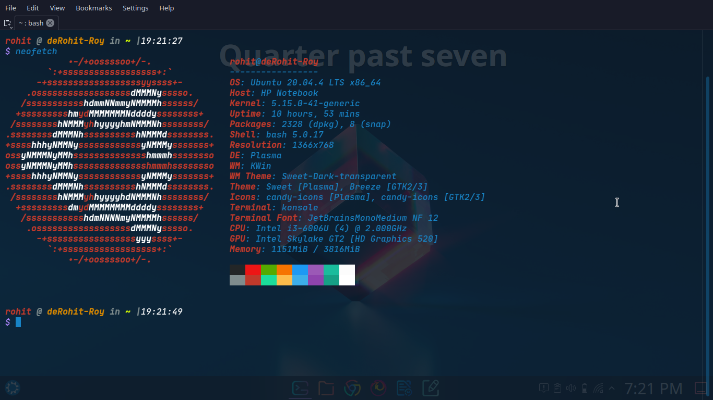
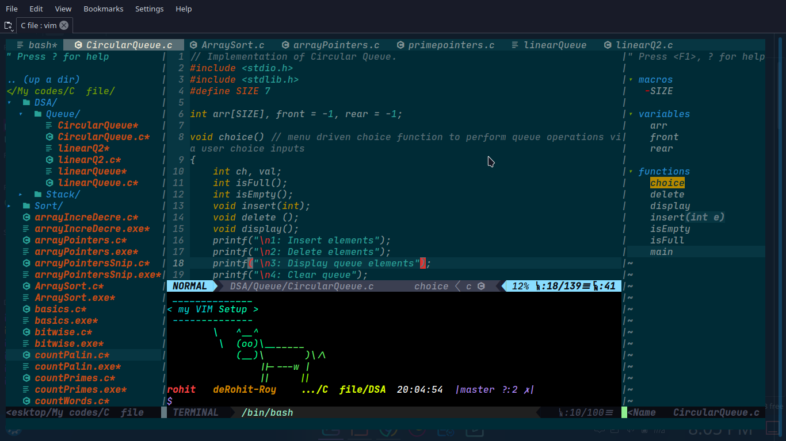

<h1 style="text-align: center; font-weight:bold">Welcome to <span style="color:chocolate">nvim-terminal-config</span> 👋</h1>


<p style="text-align: center">
  
  <a href="https://github.com/DeRoyace/nvim-terminal-config/blob/master/README.md" target="_blank">
    
  </a>
  <a href="https://github.com/DeRoyace/nvim-terminal-config/blob/master/LICENSE" target="_blank">
    &nbsp
  </a>
  <a href="https://twitter.com/deRohitRoyace" target="_blank">
    
  </a>
</p>

> Configuring terminal (bash) and Neovim for developer experience like that in VScode.

## 📷 Screenshots:



## 🏠 [Homepage](https://github.com/DeRoyace/nvim-terminal-config)

## 📌 Requires:

* <a href="https://github.com/neovim/neovim/releases/tag/v0.7.2">Neovim</a> Version **0.7.2** or above.
* <a href="https://github.com/VundleVim/Vundle.vim">Vundle </a>Plugin Manager 

## 🔌 Plugins Used:
* <a href="https://github.com/vim-airline/vim-airline">Airline</a> lean & mean status/tabline for vim that's light as air.
* <a href="https://github.com/preservim/nerdtree">NERDTree</a> a file system explorer for the Vim editor.
* <a href="https://github.com/terryma/vim-multiple-cursors">Multiple Cursors</a> True Sublime Text style multiple selections for Vim.
* <a href="https://github.com/ap/vim-css-color">CSS Color</a> A very fast, multi-syntax context-sensitive color name highlighter.
* <a href="https://github.com/ryanoasis/vim-devicons">Vim Devicons</a> Adds file type icons to Vim plugins such as: NERDTree, vim-airline, CtrlP, unite, Denite, lightline, vim-startify and many more
* <a href="https://github.com/neoclide/coc.nvim">Conquer of Completion (COC)</a> Nodejs extension host for vim & neovim, load extensions like VSCode and host language servers.
* <a href="https://github.com/preservim/tagbar">Tagbar</a> a class outline viewer for Vim
* <a href="https://github.com/nvim-treesitter/nvim-treesitter">Treesitter</a> syntax highlighter (**experimental use).
* <a href="https://github.com/turbio/bracey.vim">Bracey</a> plugin for live preview: html, css, and javascript editing in vim.
* <a href="https://github.com/pacha/vem-tabline">Tabline</a> A lightweight Vim/Neovim plugin to display buffers and tabs in the tabline.
* <a href="https://github.com/tribela/vim-transparent">Vim transparent</a> Remove all background color on Vim.
* <a href="https://github.com/kaicataldo/material.vim">Material</a> color scheme for vim.
* <a href="https://github.com/overcache/NeoSolarized">NeoSolarized</a> Another solarized color theme for truecolor neovim / vim.

## ⚙ Installation Guide:

> #### Go to **Home** > Open terminal > copy the following commands:
### **Clone the reposiotry:**
```sh
git clone https://github.com/DeRoyace/nvim-terminal-config
```
### Bash Terminal Setup:
> ⚠️ **WARNING:** Before doing anything below, make sure you create a backup for your ```.bashrc``` file.
>```sh
>cat > nvim-terminal-config/bashrc .bashrc
>```
### Neovim / Vim Setup:
```sh
cat > nvim-terminal-config/init.vim ~/.config/nvim/init.vim
```
> All your nvim config are present here ```~/.config/nvim/init.vim```
> Open nvim / vim and then ```:PluginInstall``` and hit **ENTER** to install all the plugins and get ready with your **nvim setup**.

## 🔰 Usage for Nvim / Vim
#### Open your terminal and create a ```testfile.txt```:
```sh
nvim testfile.txt
```
* By default the init.vim is configured to **transparent mode**. You can disable it by simply doing ```:TransparentDisable``` and enable it by doing```:TransparentEnable```

* To open a file explorer in the editor do this
```:NERDTree``` or ```CTRL + E ```

* To see the class outline or tags e.g. *macros, functions, varibales, etc.*, do this```:TagbarToggle ```

* To open terminal in the editor ```:term```
### 🔠 Keymaps:
* ```ALT + ⬆``` to move line Up.
* ```ALT + ⬇``` to move line Down.

* ```CTRL + ⬆``` to copy line Up. 
* ```CTRL + ⬇``` to copy line Down 

## Author ✍

👤 **Rohit Roy**

* Linktree: https://linktr.ee/Rohit_drc
* Twitter: [@deRohitRoyace](https://twitter.com/deRohitRoyace)
* Github: [@DeRoyace](https://github.com/DeRoyace)
* LinkedIn: [@rohit-roy-51b2b6222](https://linkedin.com/in/rohit-roy-51b2b6222)

## Show your support ❤️

Give a ⭐️ if this project helped you!

## 📝 License

Copyright © 2022 [Rohit Roy](https://github.com/DeRoyace).<br />
This project is [Apache License 2.0](https://github.com/DeRoyace/nvim-terminal-config/blob/master/LICENSE) licensed.

***
_This README was generated with ❤️ by [readme-md-generator](https://github.com/kefranabg/readme-md-generator)_